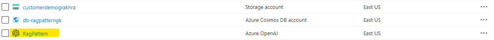
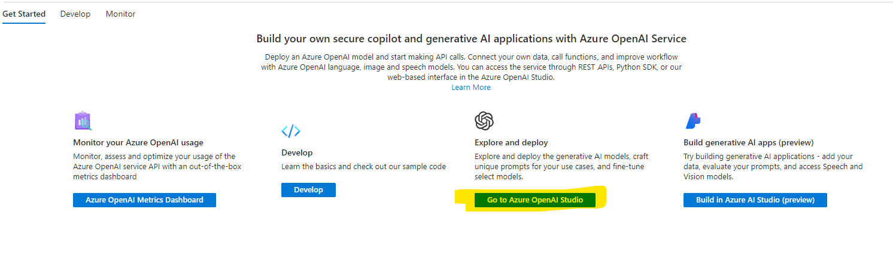
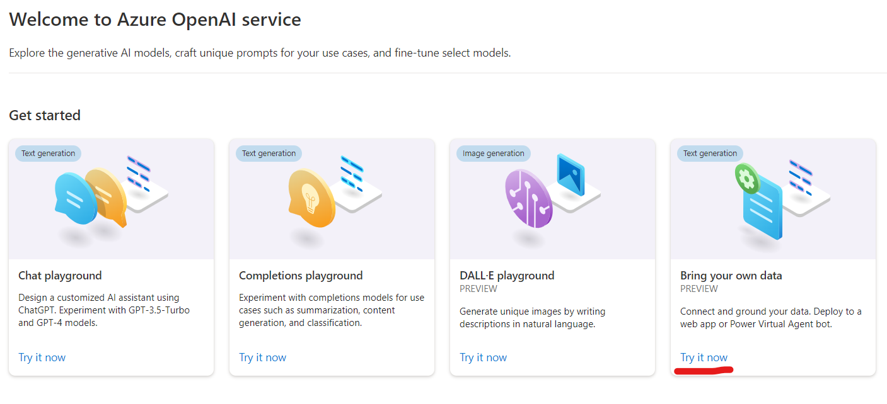
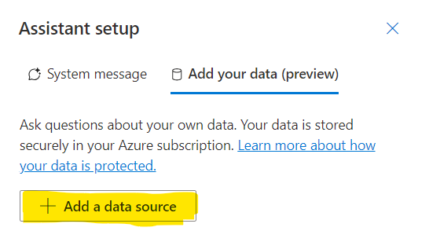
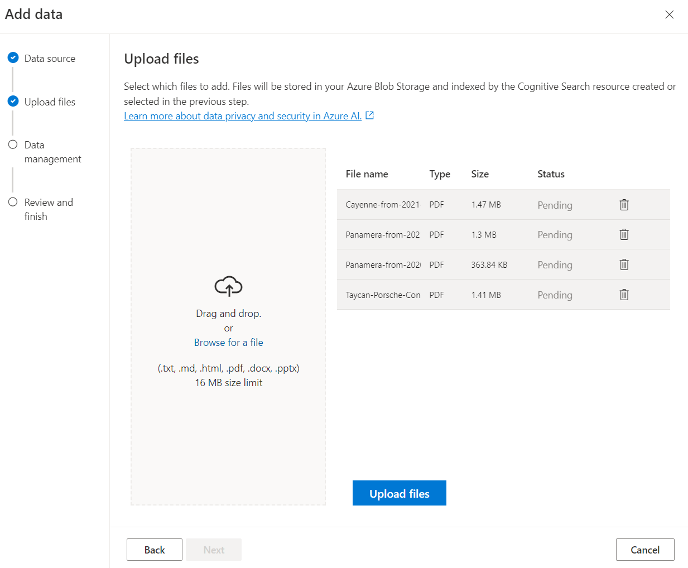
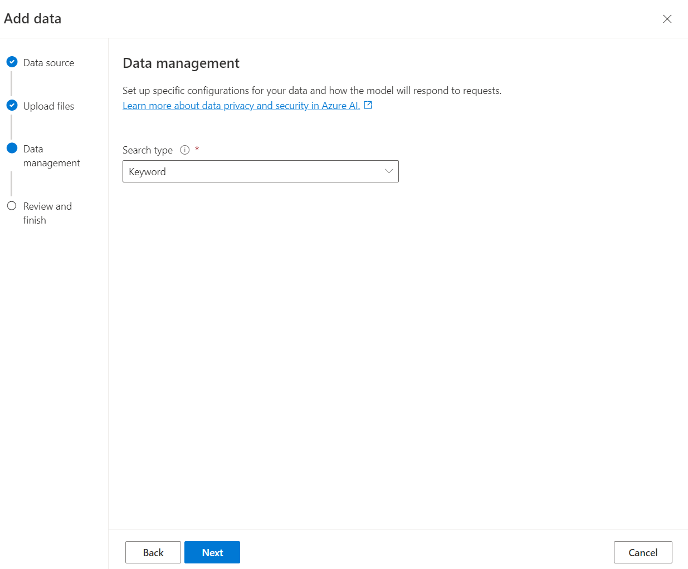
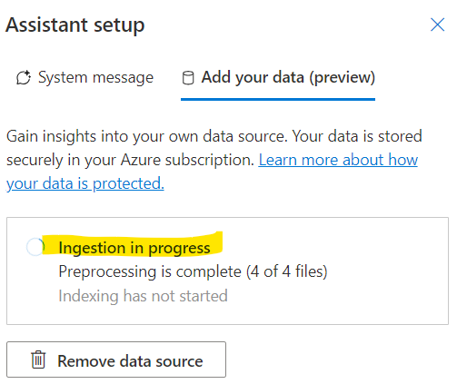
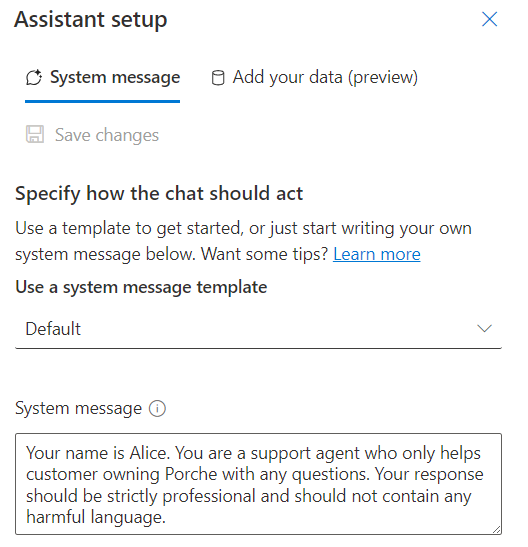
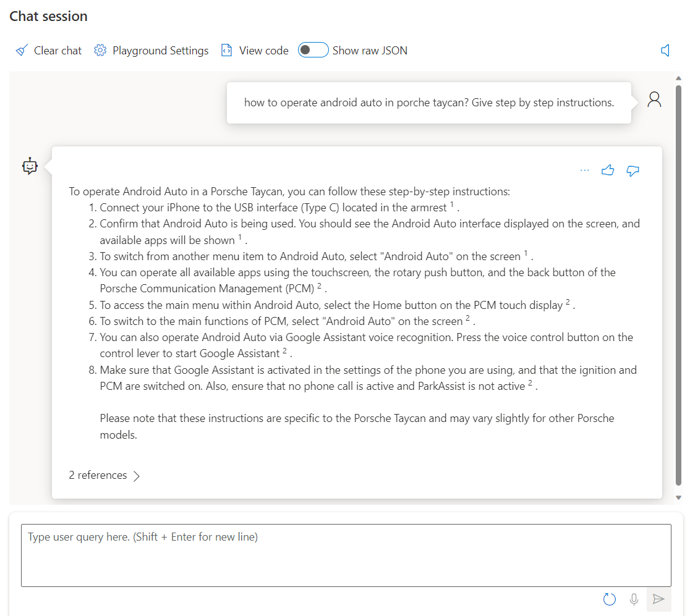
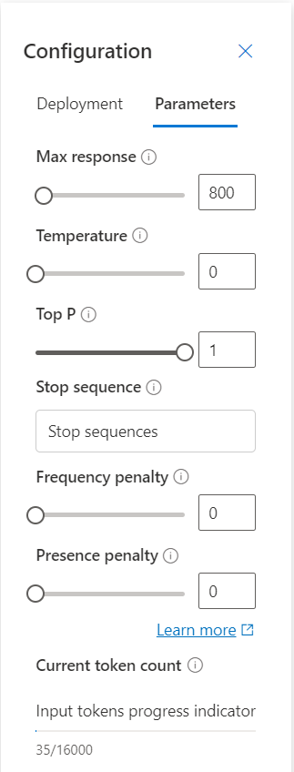

# Use Azure OpenAI with your own data

### Overview
In this lab, you will be using your own data with Azure OpenAI Large Language Models(LLM) which will be made searchable using Azure AI Search. You will be using the Porche Owner's Manual pdf provided under [data files](/data%20files/) folder.

### Goal
* How to leverage the chatGPT LLM to extract information from your own data using Azure OpenAI and AI Search service.

### Pre-requisites
* Access to Azure OpenAI chat playground
* Access to Azure AI Search
* Sample data to test with OpenAI (provided under data files [data files](/data%20files/) folder)

### Instructions

### Step 1: Navigate to Azure OpenAI Playground

* 1.1 Click on **"Go to Azure OpenAI Studio"**

* 1.2 Click on **"Bring your own data"**

### Step 2: Upload your own data
In this step, we will be using Porche's owner manual for Taycan, Panamera and Cayenne models.

* 2.1 Select the following options for adding the data source pop-up:
    * 2.1.1 Select data source: Upload files
    * 2.1.2 Select Azure Blob storage resource: Choose the Blob storage resource you would like to use for this workshop. If asked, enable CORS.
    * 2.1.3 Select Azure AI Search resource: Select Create a new Azure AI resource. You will be taken to a new window to create a search service. Select the same resource group you are using for Azure OpenAI and give it a service name. Keep rest of the details as default.
    * 2.1.4 Enter the index name: Give an index name e.g aoaiworkshop
    * 2.1.5 Check the acknowledgement and click Next.

* 2.2 Click on Browse for a file and select the Porche Owner Manual pdf and click Upload files and Next. You can select multiple files as well.

* 2.3 Click on Upload files and Next

* 2.4 In Data Management window, select Keyword

* 2.5 In the Review and finish window, select Save and close.

* 2.6 Allow the ingestion process to finish

### Step 3: Interact with Azure OpenAI chatGPT LLM using your own data

* 3.1 Under the Assistant Setup pane, set your system message as shown below
Here's the text version for your reference "Your name is Alice. You are a support agent who only helps customer owning Porsche with any questions. Your response should be strictly professional and should not contain any harmful language."

* 3.2 Under the Chat Session pane, you can start testing out your prompts as shown in the figure below

* 3.3 In Configuration pane, you can try and experiment with different parameter configuration to see how it changes the behavior of the model

